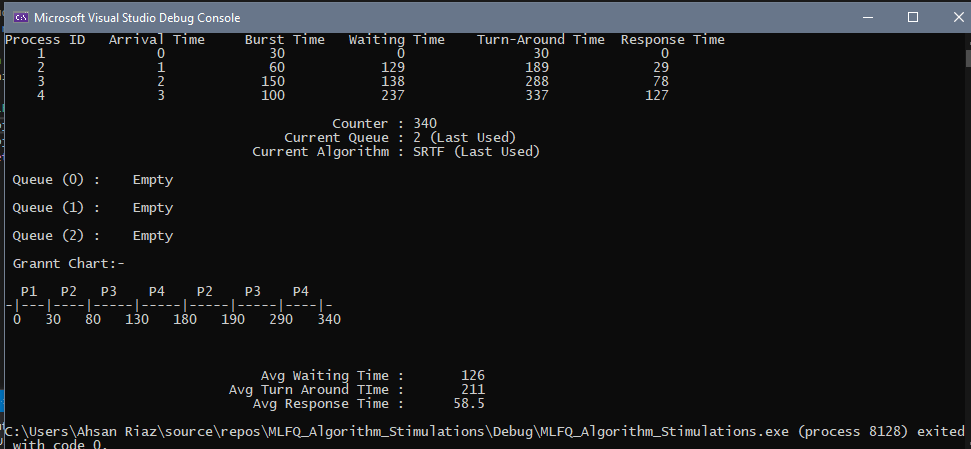

# MLFQ Algorithm Stimulation

### Submitted by:
Name: Ahsan Riaz	
Roll No: BCSF18M009
#### Date of Submission: December 1, 2020

# Aim of this projects:-
This program will stimulate the Multilevel feedback queue algorithm.

## Requirements
Minimum requirements are following:
### Language:
The language used in my project is C++ programming language.
### Tools: 
o	Dev C++ or
o	Visual Studio 2019

## Operating System:
•	Windows 10
•	Linux

## How to run the Program:
Add Driver.cpp and MLFQ.h header file in your project and built the solution. Then compile and run the program. Just open the driver class and compile and run the program. (note MLFQ.h and Driver.cpp should be in same directory)
There are 2 sources file named as:
1.	Driver.cpp
2.	MLFQ.h header

There are also 3 sample input files, input1.txt, input2.txt and input3.txt. We will use it in our main program to read data from file and run MLFQ algorithm on sample data. 
## Driver.cpp: 
•	The main() function is written in my Drive.cpp file. 
•	In main(), I create object of MLFQ, and call method setFileName(fileName);
where filename is of string type. This method will set file name attribute in MLFQ class. That will load data from this filename.
•	Then we will call the start() method of MLFQ class object. 

## Output

